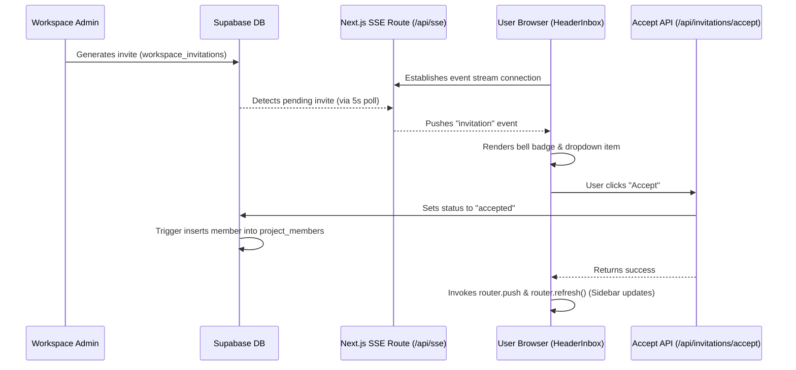

# TaskPilot Workspace & Real-Time Invitation System Walkthrough

This document details the architectural structure, directory/file organization, database updates, API endpoints, and components that power the real-time workspace management and member invitation system in TaskPilot.

---

## 🏗️ Folder Structure Overview

The system features are separated into logical directories to ensure clean segregation of concerns:

```
taskpilot/
├── plan/
│   └── update_schema.sql                  # Database migration schema additions
├── src/
│   ├── actions/
│   │   ├── invite.actions.ts              # Server Actions for sending invitations
│   │   └── workspace/
│   │       ├── workspace.actions.ts       # Core Project / Task actions
│   │       └── workspace-hub.actions.ts   # Isolated Workspace Switcher/Leave actions
│   ├── app/
│   │   ├── api/
│   │   │   ├── invitations/
│   │   │   │   ├── accept/
│   │   │   │   │   └── route.ts           # API Route to accept invitation
│   │   │   │   └── reject/
│   │   │   │       └── route.ts           # API Route to reject invitation
│   │   │   └── sse/
│   │   │       └── route.ts               # SSE route for pushing real-time invites to client
│   │   └── (protected)/
│   │       └── workspaces/
│   │           ├── loading.tsx            # Skeletal loading placeholder page
│   │           └── page.tsx               # Server Component fetching owned & member workspaces
│   ├── components/
│   │   └── workspace/
│   │       ├── Header.tsx                 # Header with Switcher info and custom Leave Modal
│   │       ├── HeaderInbox.tsx            # SSE Notification listener & Bell Badge Dropdown
│   │       ├── SettingsPanel.tsx          # Panel showing user settings and "Leave Workspace"
│   │       ├── WorkspacesClient.tsx       # Client dashboard for managing and switching workspaces
│   │       └── modals/
│   │           └── DeleteConfirmModal.tsx # Portal-rendered confirmation modal (supports workspaces)
│   └── services/
│       ├── workspace.service.ts           # Core workspace database queries
│       └── workspace-hub.service.ts       # Isolated Hub service (multi-workspace queries & leaving)
```

---

## 🔁 End-to-End Invitation Flow

The invitation system operates asynchronously and securely across server and client layers:



### 1. Generating an Invitation
* **Action**: In the project member management view, an admin invites an email address and assigns them to a specific project.
* **Database Representation**: Inserts a row into `workspace_invitations` with status `'pending'` and the target `project_id`.

### 2. Real-Time Listening (SSE)
* **API Endpoint**: `/src/app/api/sse/route.ts`
* **Mechanism**: When a user logs in, `HeaderInbox.tsx` opens a persistent EventSource connection to `/api/sse`. The route polls the database every 5 seconds for pending invitations matching the user's logged-in email. If found, it pushes an update immediately to the client without page requests.
* **UI**: The Header bell notification icon displays a red count badge. Opening the dropdown allows accepting or rejecting the invite.

### 3. Accepting the Invitation
* **API Endpoint**: `/src/app/api/invitations/accept/route.ts`
* **Execution**:
  1. Validates that the invitation exists and belongs to the authenticated user.
  2. Updates invitation status in `workspace_invitations` to `'accepted'`.
  3. Inserts a row into `workspace_members`.
  4. Triggers database procedures (see below) to auto-join the project mapping.
  5. Sets the client cookie `active_workspace_id` to switch the active layout.
  6. Refreshes routes cleanly via Next.js `useRouter.refresh()`.

---

## 🗄️ Database Trigger Configuration

To auto-populate project member relationships upon invite acceptance, a security trigger executes inside the Postgres engine:

```sql
-- Create helper trigger function to auto-assign a user to the specified project when accepted
CREATE OR REPLACE FUNCTION public.handle_accepted_invitation()
RETURNS TRIGGER AS $$
DECLARE
  v_user_id UUID;
END;
$$ BEGIN
  IF NEW.status = 'accepted' AND OLD.status = 'pending' AND NEW.project_id IS NOT NULL THEN
    -- Find the user ID matching the invite email
    SELECT id INTO v_user_id FROM public.profiles WHERE LOWER(email) = LOWER(NEW.email);
    
    IF v_user_id IS NOT NULL THEN
      -- Insert into project_members, setting role to 'member'
      INSERT INTO public.project_members (project_id, user_id, role)
      VALUES (NEW.project_id, v_user_id, 'member')
      ON CONFLICT (project_id, user_id) DO NOTHING;
    END IF;
  END IF;
  RETURN NEW;
END;
$$ LANGUAGE plpgsql SECURITY DEFINER;

-- Recreate trigger mapping
DROP TRIGGER IF EXISTS on_workspace_invitations_accepted ON public.workspace_invitations;

CREATE TRIGGER on_workspace_invitations_accepted
  AFTER UPDATE ON public.workspace_invitations
  FOR EACH ROW
  EXECUTE FUNCTION public.handle_accepted_invitation();
```

---

## 🚪 Workspace Switcher Hub & Leaving Mechanics

We isolated the switcher logic and leaving commands to support granular controls.

### 1. Workspace Switcher Hub (`/workspaces` & `WorkspacesClient.tsx`)
* A dedicated dashboard displaying **Owned Workspaces** and **Member Workspaces** side-by-side.
* Includes a **Leave** button for any workspace where the user is an invited member, allowing them to leave without switching active focus first.

### 2. Settings Panel (`SettingsPanel.tsx`)
* Displays a dedicated **Leave Workspace** card if the active workspace is a member workspace.
* Safely calls `leaveWorkspaceAction` and removes all child project permissions.

### 3. Header Action (`Header.tsx`)
* Replaces the standard **Sign Out** button in the header with a **Leave Workspace** button (`DoorOpen` icon) when the user is in a workspace they do not own.

### 4. DOM Portal Rendering (`DeleteConfirmModal.tsx`)
* Replaced standard browser `confirm()` calls in all views with the unified `DeleteConfirmModal`.
* Configured using React's `createPortal` to render directly onto `document.body` to resolve position offsets and clipping issues caused by sticky/backdrop-blur elements.

---

## ⚡ Client Navigation & Stability Enhancements

1. **State-Preserving Transitions**: Replaced all raw page reloads (`window.location.reload()`) with Next.js `useRouter` handles to prevent layout flicker.
2. **Date Hydration Mismatch Fix**: Standardized date rendering in `KanbanBoard.tsx` to print in a fully deterministic format (`Jun 9` using local getters and arrays) to resolve React SSR hydration mismatches.
3. **Forced Dynamic Rendering**: Added `export const dynamic = "force-dynamic"` to protected views so the router does not cache stale workspaces or members.
