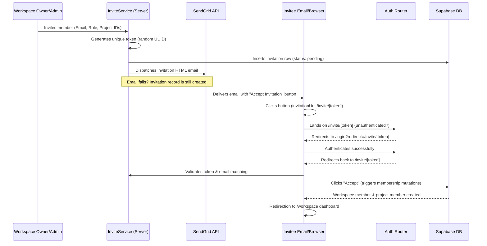

# TaskPilot Email-Based Workspace Invitation System

This document provides a comprehensive overview of the secure, email-based workspace invitation system implemented in TaskPilot. It describes the folders, database schema, end-to-end flows, security policies, and SendGrid configurations that power this feature.

---

## 🏗️ Folder Structure Overview

The invitations feature is organized following TaskPilot's modular, feature-based architecture to isolate code and minimize overlap:

```
taskpilot/
├── supabase/
│   └── migrations/
│       └── 20260615144500_update_workspace_invitations.sql  # Database migrations
├── src/
│   ├── app/
│   │   ├── (auth)/
│   │   │   ├── login/
│   │   │   │   └── page.tsx           # Login page aliasing ?redirect to ?next
│   │   │   └── signup/
│   │   │       └── page.tsx           # Signup page aliasing ?redirect to ?next
│   │   └── invite/
│   │       ├── accept/
│   │       │   └── page.tsx           # Legacy route redirecting to /invite/[token]
│   │       └── [token]/
│   │           └── page.tsx           # Dynamic token-based accept/reject page
│   ├── lib/
│   │   └── email/
│   │       ├── sendgrid.ts            # SendGrid mail service helper wrapper
│   │       └── templates/
│   │           └── invitation-email.ts # Branded responsive HTML email template
│   └── features/
│       ├── auth/
│       │   └── components/
│       │       ├── login-form.tsx     # Resolves ?redirect params during form submit
│       │       └── signup-form.tsx    # Resolves ?redirect params during form submit
│       ├── workspace/
│       │   ├── actions/               # Legacy actions delegating to invitations feature
│       │   │   ├── accept-invitation.action.ts
│       │   │   ├── create-invitation.action.ts
│       │   │   └── decline-invitation.action.ts
│       │   └── services/
│       │       └── invite.service.ts  # Legacy service re-exporting new service
│       └── invitations/
│           ├── actions/               # Core invitation server actions
│           │   ├── accept-invitation.action.ts
│           │   ├── create-invitation.action.ts
│           │   └── reject-invitation.action.ts
│           ├── components/
│           │   └── accept-invite-client.tsx # Accept/decline client interactive UI
│           ├── repositories/
│           │   └── invitation.repository.ts # Supabase DB query layer
│           └── services/
│               └── invite.service.ts  # Core invitation logic (token gen, SendGrid trigger)
```

---

## 🔁 End-to-End Invitation Flow

The invitation flow combines server actions, secure database constraints, external email delivery, and user authentication:



---

## ⚙️ Detailed Architectural Breakdown

### 1. Database Schema (`workspace_invitations`)
The schema enforces constraints and preserves structural mapping:
- **`token`** (`UUID NOT NULL UNIQUE DEFAULT gen_random_uuid()`): Sent to the recipient in the URL query parameters. Serves as the primary validation key.
- **`email`** (`TEXT NOT NULL`): The email address invited to the workspace.
- **`role`** (`TEXT NOT NULL`): The target role inside the workspace (`'admin'` or `'member'`).
- **`status`** (`TEXT NOT NULL`): Invitation states: `'pending'`, `'accepted'`, or `'declined'`.
- **`expires_at`** (`TIMESTAMP WITH TIME ZONE`): Expiration limit set to 7 days from creation.
- **`project_ids`** (`UUID[]`): Projects the user will join immediately upon acceptance.

### 2. SendGrid Integration
- Wraps SendGrid inside `src/lib/email/sendgrid.ts` using `@sendgrid/mail`.
- Configured using environment variables:
  - `SENDGRID_API_KEY`: API authentication key.
  - `SENDGRID_FROM_EMAIL`: The verified Single Sender Identity email address (configured to `vsumit1762@gmail.com`).
- Delivery errors are caught and logged inside the action thread, preventing mail failures from blocking or rolling back invitation creation.

### 3. Invitation Creation Flow
1. **Verification**: Checks if the user performing the invite holds admin or owner privileges in the workspace.
2. **Member Check**: Checks if the invitee is already a workspace member.
3. **Pending Check**: Checks for any unexpired pending invitation to the same email for this workspace.
4. **Token Generation**: Generates a cryptographically secure random UUID token.
5. **Database Entry**: Inserts the row into `workspace_invitations` with a 7-day expiration.
6. **SendGrid Call**: Resolves workspace, inviter, and project details, constructs the HTML email, and dispatches it via SendGrid.

### 4. Interactive Invite UI & Accept Page
- Located at `/invite/[token]`.
- Checks for active sessions using `getSession()`. If missing, forces Next.js redirection to `/login?redirect=/invite/[token]`.
- Displays workspace title, inviter name, role details, and assigned projects list.
- **Security Check**: Before displaying the Accept button, checks that the authenticated user's email matches the invitation email. If they differ, an "Email Mismatch" screen appears with a Sign Out option.
- **Accept Action**:
  - Adds user to `workspace_members`.
  - Adds user to `project_members` for all assigned project IDs.
  - Sets all other pending invitations for this email in this workspace to `'accepted'`.
  - Sets active workspace cookie `active_workspace_id`.
  - Records real-time notifications for owners/inviters.
- **Reject Action**:
  - Sets invitation status to `'declined'`.
  - Emits real-time notifications for owners/inviters.

---

## 🔒 Security Policies & Validation Rules

- **Inviter Privilege Verification**: Before creating the invitation, the system queries workspace membership roles to confirm the inviter is either the workspace owner or holds the `admin` role.
- **Authentication Redirect Pipeline**: When an unauthenticated user lands on `/invite/[token]`, they are redirected with the `redirect` query parameter. Both the Login and Signup pages capture this parameter, appending it to form submission actions so the user is returned to the exact invitation validation page after successful sign-in.
- **Email Mismatch Protection**: Protects workspaces against unauthorized access by preventing users signed in with a different account from accepting an invitation intended for another email address.
- **Token Validity Enforcement**: The page checks:
  - If the token exists.
  - If the status is `'pending'`.
  - If the current time is less than `expires_at`.
