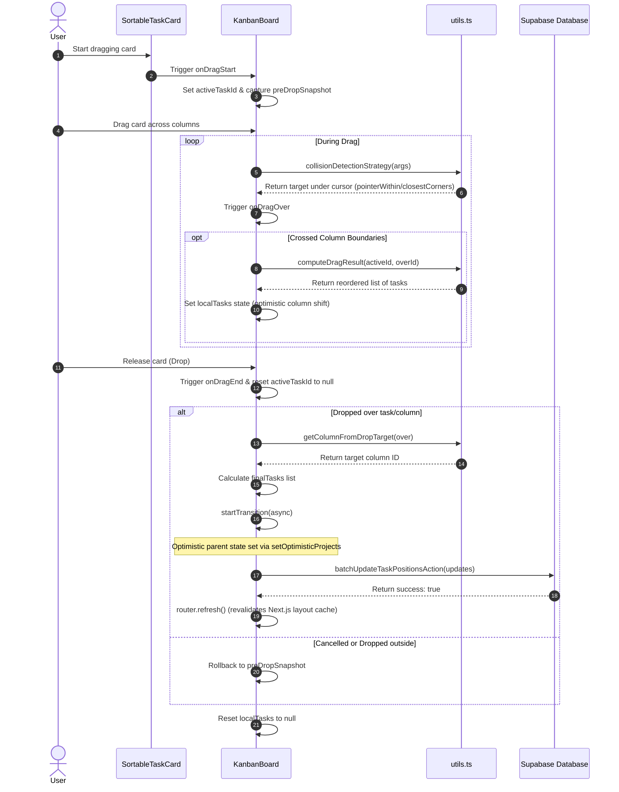

# TaskPilot — Kanban Board & Drag-and-Drop Implementation

This document provides a detailed technical guide to the Kanban board and its drag-and-drop (DND) mechanics in TaskPilot. It outlines the libraries used, the exact state flow of working, RLS constraints, and how the empty column bug was resolved.

---

## 1. Drag-and-Drop Architecture Overview

TaskPilot's Kanban board is built on top of **`@dnd-kit`** (`@dnd-kit/core` and `@dnd-kit/sortable`). This stack was chosen for its accessibility support, performance, and flexibility in rendering drag animations using standard React concepts.

### Component Structure
* **`KanbanBoard.tsx`**: The main controller component. Houses the `<DndContext>`, handles the active drag states, manages the optimistic React transition lifecycle, and coordinates the drag overlay.
* **`KanbanColumn.tsx`**: Individual column container (e.g., *To Do*, *In Progress*, *Done*). Registered as a droppable zone using `useDroppable` and implements a `<SortableContext>` stack.
* **`SortableTaskCard.tsx`**: Wrapper component for task cards that hooks into `useSortable`. It provides the drag attributes, listeners, and transform styles required by `@dnd-kit`.
* **`TaskCard.tsx`**: The raw presentation component for a task card, styling the task details, priority badge, and assignee avatar.
* **`utils.ts`**: Helper functions managing calculations, such as sorting task indices, grouping tasks, and re-indexing arrays during active moves.

---

## 2. Interactive Drag-and-Drop Flow of Working

The DND system utilizes a dual-state architecture:
1. **Local State (`localTasks`)**: Provides instant, high-performance optimistic visual updates during the drag action and during the transition.
2. **Server State (`project.tasks`)**: The source-of-truth server data. Persisted to Supabase PostgreSQL using Next.js Server Actions.

Here is the exact lifecycle of a drag operation:



---

## 3. Empty Column Collision Detection Strategy & Resolution

### Why the Bug Happened
* **Active Node Overlap on Drop**: At drop time, `dnd-kit` sometimes reports `event.over` equal to the dragged item's ID (especially when the pointer is slightly outside the intended drop target or due to nested RSC wrapper nodes). The code previously used that `over` directly, which caused the board to treat the drop as staying in the source column.
* **Mismatched Droppable Ref**: The droppable ref was on an outer wrapper while the visible drop area was the inner list.
* **Tiny/No Hitboxes**: Empty columns had tiny or non-existent hit areas, causing pointer collisions to miss them.

### How the Fix Works
* **Predictable Hitbox Placement**: Make the actual scrollable list the droppable node so it has a predictable, non-zero hitbox.
* **Pointer-First Proximity Hybrid**: Prefer column hits from `pointerWithin`; if ambiguous, map the pointer to a column's rect or choose the nearest column so empty columns are successfully detected.
* **Active Node Fallback**: When `over` equals the active item at drop, fall back to the last meaningful `over` observed while dragging so the system computes the correct target column and position.

### Implementation Code
Below is the custom collision detection strategy implemented in `KanbanBoard.tsx`:

```typescript
  const collisionDetectionStrategy: CollisionDetection = useCallback(
    (args) => {
      // 1. Try finding collision by checking if pointer is physically within a container
      const pointerCollisions = pointerWithin(args);
      let overId = getFirstCollision(pointerCollisions, "id");

      if (overId != null) {
        // If the pointer is over a column container
        if (String(overId).startsWith("column-")) {
          const columnId = String(overId).replace("column-", "") as TaskStatus;
          const containerItems = tasksByColumn[columnId] || [];

          // If the column has items, find the closest task card in this column using closestCorners
          if (containerItems.length > 0) {
            const itemIds = new Set(containerItems.map((item) => item.id));
            const filteredContainers = args.droppableContainers.filter(
              (container) => itemIds.has(String(container.id))
            );

            const itemCollisions = closestCorners({
              ...args,
              droppableContainers: filteredContainers,
            });

            if (itemCollisions.length > 0) {
              return itemCollisions;
            }
          }
        }

        return pointerCollisions;
      }

      // 2. If no pointer collision is found, fallback to closestCorners
      return closestCorners(args);
    },
    [tasksByColumn]
  );
```

1. **`pointerWithin(args)`**: First checks if the mouse cursor coordinates are physically inside any droppable bounds. Because empty columns maintain a minimum height and padding, they occupy actual screen real estate. As soon as the pointer crosses into the empty column's area, it is identified as the collision target.
2. **Task Card Proximity Filtering**: If the pointer is inside a column, but that column *does* contain tasks, the strategy runs `closestCorners` exclusively against the cards inside that column. This ensures the card can be inserted precisely above or below other cards in the stack.
3. **`closestCorners` Fallback**: If the pointer is not directly inside any container, the strategy falls back to corner proximity to keep dragging fluid.

---

## 4. Persistance & Database RLS Policies

When a task is dropped and the new coordinates are verified:
1. `KanbanBoard` compiles a list of position updates:
   ```typescript
   updates: { id: string; status: TaskStatus; position: number }[]
   ```
2. The board triggers the `onTasksReorder` prop, which executes the server action `batchUpdateTaskPositionsAction(updates)`.
3. In PostgreSQL, tasks are protected by Row Level Security (RLS) policies. To support drag-and-drop for both workspace **owners** and **members**, the RLS policy is evaluated as follows:
   ```sql
   CREATE POLICY "Members can update tasks" ON tasks FOR UPDATE
   TO authenticated USING (
     project_id IN (
       SELECT id FROM projects WHERE 
       workspace_id IN (SELECT workspace_id FROM workspace_members WHERE user_id = auth.uid()) OR 
       workspace_id IN (SELECT id FROM workspaces WHERE owner_id = auth.uid())
     )
   )
   ```
   This ensures any workspace member is fully authorized to update positions for any tasks belonging to projects inside their workspace, enabling members to reorder tasks identically to workspace owners.

---

## 5. Realtime Board Synchronization

To keep multiple users working on the same board in sync, the drag-and-drop actions are paired with **Supabase Realtime** subscriptions.

* **Optimistic Local Moves**: When a user drags a card, React 19's `useOptimistic` hook updates the board layout locally with zero lag.
* **Server Action Commit**: The board triggers `batchUpdateTaskPositionsAction` which updates the records in the database.
* **Realtime Broadcast**: Once Postgres commits the updates, the Supabase Realtime channel broadcasts the `UPDATE` events containing the updated task statuses and positions to all other active board viewers.
* **State Reconciliation**: The `useProjectBoard` hook listens to the broadcast and updates the local state (`currentProjects`), aligning other browsers' layouts to match the new task positions automatically. For a deeper look, check out the detailed [Realtime-Implementation.md](file:///home/hp/Desktop/practise/TaskPilot/taskpilot/plan/Realtime-Implementation.md).
