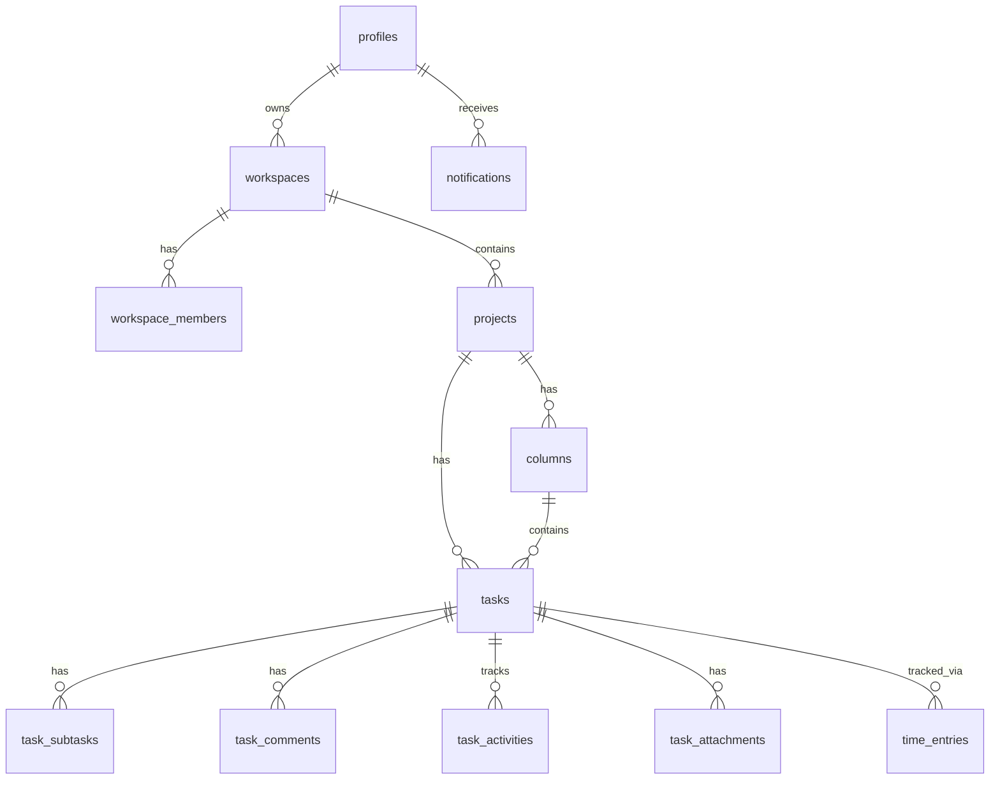

# TaskPilot - Project Overview

## 1. Executive Summary

**TaskPilot** is a modern, comprehensive project management and team collaboration platform inspired by industry leaders like Jira, Trello, and Linear. It serves as a centralized hub for teams to plan, track, and manage their workflows effectively.

* **Primary Goals**: To provide an adaptable, intuitive workspace that unifies task management, project tracking, and real-time team collaboration without the clutter of overly complex enterprise tools.
* **Key Business Value**: TaskPilot boosts team productivity by streamlining task delegation, ensuring data consistency with real-time updates, and reducing context switching through an all-in-one unified interface for planning and communication.
* **Target Users**: Software development teams, product managers, designers, and agile teams looking for a responsive, modern tracking tool.

---

## 2. Core Features

* **Authentication & User Management**: Secure email/password and GitHub OAuth sign-in, handled securely through Supabase Auth with server-side session management. Includes robust password recovery flows.
* **User Profiles**: Users can personalize their accounts by updating display names and uploading custom profile avatars, powered by secure Supabase Storage.
* **Workspace Management**: Users can create, manage, and switch between multiple workspaces. The UI intelligently adapts, such as hiding the workspace switcher for single-workspace users.
* **Project Management**: Group tasks into projects. Each project maintains its own lifecycle, board, and member access. Workspace admins and owners have elevated permissions to manage project resources.
* **Kanban Board**: A highly interactive, visual board for tracking task progress across customizable columns (e.g., To Do, In Progress, Done).
* **Task Management**: Create detailed tasks with titles, rich text descriptions, due dates, subtasks, and assignees.
* **Drag & Drop Task Reordering**: Seamless drag-and-drop experience across columns and vertical reordering within columns.
* **Task Attributes**: Categorize task urgency using Low, Medium, and High priorities, and classify work by type (e.g., Feature, Bug, Enhancement).
* **Task Attachments**: Securely upload, preview, and manage file attachments (images, PDFs) associated with tasks via Supabase Storage.
* **Time Tracking**: Built-in global timer and manual time logging per task, including visual statistics, progress comparison against estimates, and historical logs.
* **Team Management & Invitations**: Robust member management with role-based access control (Owner, Admin, Member). Features secure workspace departure and sign-out confirmation flows.
* **Global Search & Persistence**: Centralized search across dashboards (Projects, Kanban, Teams, Members) that persists via URL parameters for real-time filtering and link sharing.
* **Comments & Collaboration**: Task-level comment threads with `@` user mentions to facilitate asynchronous communication.
* **Activity Timeline & Pagination**: Auto-generated chronological feeds tracking significant task changes, utilizing paginated "Load More" fetching for optimal performance.
* **Notifications System**: Integrated in-app notifications for task assignments, project additions, and workspace removals, alongside email delivery for workspace invitations via SendGrid.
* **Responsive UI**: A highly polished, monochrome dark mode interface built with Tailwind CSS that adapts seamlessly to varying screen sizes.

---

## 3. Technical Architecture

TaskPilot employs a modern, server-first React architecture leveraging the latest Next.js features.

* **Frontend Architecture**: Built with Next.js App Router using React Server Components for fast initial page loads and reduced client bundle size. Client components ("islands") are used strictly for interactive features (e.g., the Kanban board).
* **Backend Architecture**: Utilizes Next.js Server Actions for all data mutations, replacing traditional API routes and providing end-to-end type safety.
* **Database Structure**: Supabase PostgreSQL serves as the primary data store, with deeply relational tables and Row Level Security (RLS) enforcing tenant isolation.
* **Authentication Flow**: JWT session management via `@supabase/ssr`, securely storing session tokens in HTTP-only cookies and proxy middleware for route guarding.
* **State Management**: Heavily relies on server-side state (React Server Components). Complex client state (like Drag & Drop) is managed via local React state (`useState`, `useOptimistic`), while UI states like search queries are synced directly to URL search parameters.
* **Server Actions**: All user interactions that mutate data trigger Next.js Server Actions which strictly validate input via Zod before interacting with the database.
* **API Communication**: Next.js Server components communicate directly with the Supabase database. Server actions handle form submissions and RPC calls.
* **Real-time Architecture**: Supabase Realtime (WebSockets) listens to Postgres WAL changes, instantly syncing board, comments, and member states across all connected clients.

---

## 4. Technology Stack

| Technology | Purpose | Why it was chosen |
| :--- | :--- | :--- |
| **Next.js (App Router)** | Full-stack Framework | Provides Server Components, Server Actions, and file-based routing for optimal performance and SEO. |
| **React** | UI Library | Component-driven architecture makes building complex interactive UIs manageable and scalable. |
| **TypeScript** | Language | End-to-end type safety catches bugs at compile time and improves developer experience. |
| **Tailwind CSS** | Styling | Utility-first CSS allows for rapid UI development and a cohesive, semantic design system. |
| **Shadcn/UI** | Component Library | Unstyled, accessible component primitives that can be completely customized to fit the app's aesthetic. |
| **Supabase** | Backend-as-a-Service | Provides managed PostgreSQL, Auth, Storage (for attachments and avatars), and Realtime WebSocket syncing out of the box. |
| **PostgreSQL** | Relational Database | Reliable, ACID-compliant database perfect for complex relationships (workspaces, projects, tasks). |
| **Zod** | Schema Validation | Type-safe schema validation ensures all incoming data through Server Actions is strictly verified. |
| **React Hook Form** | Form Management | Highly performant form state management with easy Zod integration. |
| **DnD Kit** | Drag & Drop Engine | Lightweight, highly accessible drag-and-drop library required for the Kanban board. |
| **SendGrid** | Email Delivery | Reliable transactional email delivery for workspace invitations. |
| **Vitest** | Testing Framework | Fast unit testing framework used for validating complex business logic, schemas, and actions. |

---

## 5. Database Design

The database schema is highly relational, designed for tenant isolation and real-time updates.

* **Main Tables**:
  * `profiles`: User information linked to Supabase Auth, storing display names and avatar URLs.
  * `workspaces` & `workspace_members`: Top-level tenant isolation and access control.
  * `projects`: Groups of tasks within a workspace.
  * `columns` & `tasks`: Kanban board structure and task entities.
  * `task_activities`, `task_comments`, `task_subtasks`, `task_attachments`: Detailed relational data for task tracking and file management.
  * `time_entries`: Dedicated table for tracking time spent on tasks.
  * `notifications`: Unified table for in-app alerts (assignments, removals).
* **Storage**: A secure Supabase Storage bucket (`avatars`) manages user-uploaded profile imagery.
* **Relationships**: A Workspace has many Projects. A Project has many Columns and Tasks. Tasks belong to a Column and can be assigned to a Workspace Member.
* **Task Ordering & Fractional Indexing**: The `position` column uses `DOUBLE PRECISION` to implement fractional indexing. Instead of recalculating all task indexes upon a drag-and-drop move, the moved task is assigned a `position` value exactly halfway between its new surrounding siblings.



---

## 6. Authentication & Security

Security is deeply integrated at both the application and database levels.

* **Supabase Auth**: Manages user identities via Email/Password and GitHub OAuth. Supports secure password resets via token exchange.
* **Protected Routes**: Next.js Middleware acts as a proxy, intercepting requests to protected routes and redirecting unauthenticated users to the login page.
* **Role-Based Access Control (RBAC)**: Enforced via `workspace_members` (`owner`, `admin`, `member`), determining who can invite users, manage project members, or delete workspaces.
* **Row Level Security (RLS)**: PostgreSQL RLS policies strictly restrict database access. E.g., Users can only `SELECT` tasks if their `auth.uid()` exists in the `workspace_members` table for that task's parent workspace. Storage buckets also enforce RLS for avatar uploads.
* **Server-side Validation (Zod)**: All Server Actions rigorously parse incoming payloads against Zod schemas. Invalid payloads are rejected before they ever reach the database query layer.
* **Destructive Action Guards**: UI-level `ConfirmModals` wrap all destructive actions (sign-outs, workspace departures, deletions) to prevent accidental data loss or lockouts.

---

## 7. Major Technical Challenges & Solutions

### Drag & Drop Ordering
* **Problem**: Reordering tasks in a large kanban column caused massive database overhead if every task's index had to be updated sequentially.
* **Solution**: Implemented **Fractional Indexing**. Tasks are assigned a double-precision float. Moving a task simply updates its position to `(prevTask.position + nextTask.position) / 2`.
* **Outcome**: Drag and drop requires exactly one database row update, achieving `O(1)` performance.

### URL-Driven State for Global Search
* **Problem**: Passing search state deeply through nested client components (Dashboards, Kanban boards, Lists) caused prop-drilling and rendered the application state difficult to share.
* **Solution**: Elevated search state to the browser's URL search parameters. The centralized `SearchInput` component updates the URL, and server components parse this query dynamically.
* **Outcome**: Instantaneous filtering across the application with zero prop-drilling, enabling users to bookmark and share specific filtered views.

### Idempotent Onboarding & OAuth Signups
* **Problem**: New users signing up via GitHub OAuth were not reliably being added to their default workspace due to asynchronous race conditions.
* **Solution**: Standardized the onboarding path by migrating the workspace and membership creation logic into the core auth callback layer. Implemented an idempotent onboarding guard ensuring a profile, a default workspace, and an owner membership record are atomically created upon first login.
* **Outcome**: A bulletproof onboarding flow where every new user receives a fully functioning default workspace without manual intervention.

### Optimistic UI Updates
* **Problem**: Network latency caused the UI to feel sluggish when moving tasks or checking off subtasks.
* **Solution**: Utilized React's `useOptimistic` hook and local state to immediately update the DOM, while the Next.js Server Action resolves in the background.
* **Outcome**: A snappy, native-feeling user experience regardless of network speed.

---

## 8. Performance Optimizations

* **Server-Side Rendering (SSR)**: Initial page loads are rendered on the server, ensuring users see populated kanban boards and dashboard analytics instantly without client-side loading spinners.
* **Data Pagination**: Infinite feeds like the Recent Activity log employ "Load More" cursor-based pagination, ensuring the initial database query remains exceptionally fast.
* **Component Optimization**: Kanban cards and complex interactive elements utilize React `memo` and optimized `useEffect` hooks to prevent unnecessary re-renders during rapid interactions.
* **Efficient Database Queries**: Parallel data fetching is used on dashboards to execute independent aggregate queries concurrently, reducing waterfall delays.
* **Code Splitting**: Heavy components like `@dnd-kit` are code-split using `next/dynamic` to keep the initial JavaScript bundle small.

---

## 9. Project Structure

TaskPilot follows a feature-driven folder structure for scalability and maintainability:

```text
taskpilot/
├── src/
│   ├── app/              # Next.js App Router (pages, layouts, middleware)
│   │   ├── (auth)/       # Authentication routes (login, signup, reset)
│   │   └── (protected)/  # Dashboard, workspace, and project routes
│   ├── components/       # Shared, highly reusable UI components
│   │   └── ui/           # Shadcn/UI primitives (buttons, dialogs, inputs)
│   ├── features/         # Feature-based business logic (Domain Driven)
│   │   ├── auth/         # Auth forms, actions, schemas, modals
│   │   ├── kanbanboard/  # Board UI, Drag & Drop logic, hooks
│   │   ├── project/      # Project creation, actions, list views
│   │   ├── tasks/        # Task details modal, activity timeline, actions
│   │   └── workspace/    # Workspace settings, member management, charts
│   └── lib/              # Core utilities and shared configuration
│       ├── realtime/     # Supabase WebSocket connection hooks
│       ├── supabase/     # DB client initialization (server/client)
│       └── validations/  # Centralized Zod schemas
└── tests/                # Vitest validation and action suites
```

---

## 10. Development Workflow

* **Validation Strategy**: Zod schemas are defined first to create the contract for data shape. Forms and API endpoints derive their TypeScript types from these schemas.
* **Testing Strategy**: Vitest is used to strictly test business validation rules and evaluate coverage across server actions and component interactions.
* **Feature Development Process**: Follows a slice-by-slice approach: Schema definition ➔ Server Action ➔ UI Component ➔ React State/Optimistic Update ➔ Realtime Listener.
* **Code Review & Quality**: Enforced via ESLint rules customized for Next.js (ensuring strict hook dependencies and `<Image>` standards), strict TypeScript compilation, and Prettier formatting.
* **Deployment Workflow**: Optimized for Vercel deployment, utilizing standard `npm run build` checks to verify type safety and linting prior to production release.

---

## 11. Future Enhancements

* **Advanced Command Palette (Cmd+K)**: Expand the global search into a full command palette for instantly taking actions (e.g., creating tasks, navigating settings) directly from the keyboard.
* **Rich Text Attachments**: Leverage the existing Supabase Storage integration to allow users to attach images, documents, and files directly to tasks or comments.
* **Calendar & Timeline Views**: Provide calendar and Gantt-style timeline views for tracking project deadlines and task durations visually.
* **End-to-End (E2E) Testing**: Introduce Playwright or Cypress to automate full-suite browser testing of critical paths like authentication and Drag-and-Drop operations.

---

## 12. Lessons Learned

* **State Synchronization is Hard**: Balancing Optimistic UI with Server-side Truth requires careful architecture. Relying purely on WebSockets for UI updates is too slow; local optimistic state paired with background server reconciliation proved to be the golden path.
* **Server Actions Simplify Architecture**: Next.js Server Actions drastically cut down boilerplate by eliminating the need for dedicated REST API route handlers, keeping mutation logic tightly coupled with the forms that use them.
* **URL State Trumps Local State for Navigation**: Moving search query state to the URL search parameters immediately unlocked deep linking, reduced prop drilling, and provided a more robust web experience compared to isolated `useState` hooks.
* **Fractional Indexing is Essential**: Handling arbitrary ordering in a relational database is a well-known anti-pattern if done sequentially. Fractional indexing is a powerful paradigm shift that guarantees database performance at scale.

---

## 13. Conclusion

TaskPilot is a robust demonstration of modern full-stack engineering. It successfully merges the rapid interactivity of a Single Page Application with the SEO and performance benefits of Server-Side Rendering. By leveraging Next.js, Supabase, and a meticulously crafted relational database, TaskPilot delivers a production-ready, highly responsive workspace that stands as a testament to best practices in architecture, security, and user experience design.
