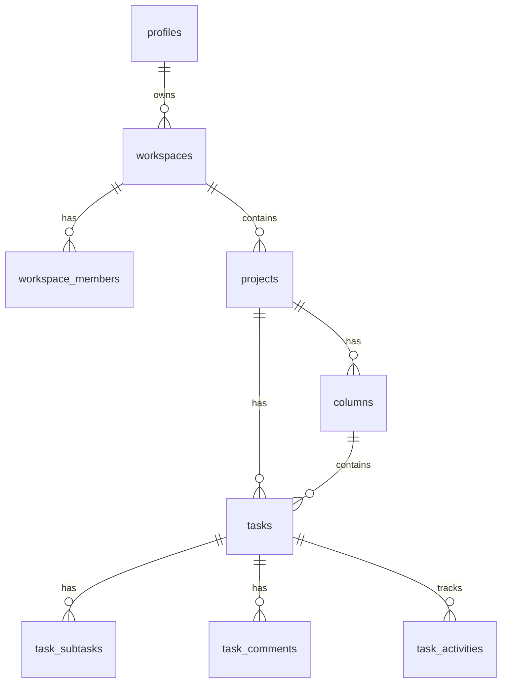

# TaskPilot - Project Overview

## 1. Executive Summary

**TaskPilot** is a modern, comprehensive project management and team collaboration platform inspired by industry leaders like Jira, Trello, and Linear. It serves as a centralized hub for teams to plan, track, and manage their workflows effectively.

* **Primary Goals**: To provide an adaptable, intuitive workspace that unifies task management, project tracking, and real-time team collaboration without the clutter of overly complex enterprise tools.
* **Key Business Value**: TaskPilot boosts team productivity by streamlining task delegation, ensuring data consistency with real-time updates, and reducing context switching through an all-in-one unified interface for planning and communication.
* **Target Users**: Software development teams, product managers, designers, and agile teams looking for a responsive, modern tracking tool.

---

## 2. Core Features

* **Authentication & User Management**: Secure email/password and GitHub OAuth sign-in, handled securely through Supabase Auth with server-side session management.
* **Workspace Management**: Users can create, manage, and switch between multiple workspaces, acting as top-level organizational tenants.
* **Project Management**: Group tasks into projects. Each project maintains its own lifecycle, board, and member access.
* **Kanban Board**: A highly interactive, visual board for tracking task progress across customizable columns (e.g., To Do, In Progress, Done).
* **Task Management**: Create detailed tasks with titles, rich text descriptions, due dates, subtasks, and assignees.
* **Drag & Drop Task Reordering**: Seamless drag-and-drop experience across columns and vertical reordering within columns.
* **Task Priorities**: Categorize task urgency using Low, Medium, and High priorities.
* **Task Types**: Classify work by type (e.g., Feature, Bug, Enhancement) to quickly filter and assess board health.
* **Team Management**: Robust workspace and project-level member management with role-based access control (Owner, Admin, Member).
* **Comments & Collaboration**: Task-level comment threads with `@` user mentions to facilitate asynchronous communication.
* **Activity Timeline**: Auto-generated chronological feeds tracking significant task changes (status updates, assignee changes, etc.).
* **Email Notifications**: Integrated email delivery for workspace invitations via SendGrid.
* **Filtering**: Quick filtering capabilities (by task type, priority, or assignee) for large project boards.
* **Dashboard & Analytics**: Real-time workspace analytics including task distribution charts and completion rate tracking.
* **Responsive UI**: A highly polished, monochrome dark mode interface built with Tailwind CSS that adapts seamlessly to varying screen sizes.

---

## 3. Technical Architecture

TaskPilot employs a modern, server-first React architecture leveraging the latest Next.js features.

* **Frontend Architecture**: Built with Next.js App Router using React Server Components for fast initial page loads and reduced client bundle size. Client components ("islands") are used strictly for interactive features (e.g., the Kanban board).
* **Backend Architecture**: Utilizes Next.js Server Actions for all data mutations, replacing traditional API routes and providing end-to-end type safety.
* **Database Structure**: Supabase PostgreSQL serves as the primary data store, with deeply relational tables and Row Level Security (RLS) enforcing tenant isolation.
* **Authentication Flow**: JWT session management via `@supabase/ssr`, securely storing session tokens in HTTP-only cookies and proxy middleware for route guarding.
* **State Management**: Heavily relies on server-side state (React Server Components), while complex client state (like Drag & Drop) is managed via local React state (`useState`, `useOptimistic`) and synced seamlessly with the server.
* **Server Actions**: All user interactions that mutate data (creating tasks, inviting members) trigger Next.js Server Actions which validate input via Zod before interacting with the database.
* **API Communication**: Next.js Server components communicate directly with the Supabase database. Server actions handle form submissions and RPC calls.
* **Real-time Architecture**: Supabase Realtime (WebSockets) listens to Postgres WAL changes, instantly syncing board and notification state across all connected clients without manual polling.

---

## 4. Technology Stack

| Technology | Purpose | Why it was chosen |
| :--- | :--- | :--- |
| **Next.js (App Router)** | Full-stack React Framework | Provides Server Components, Server Actions, and file-based routing for optimal performance and SEO. |
| **React** | UI Library | Component-driven architecture makes building complex interactive UIs manageable and scalable. |
| **TypeScript** | Language | End-to-end type safety catches bugs at compile time and improves developer experience. |
| **Tailwind CSS** | Styling | Utility-first CSS allows for rapid UI development and a cohesive, semantic design system. |
| **Shadcn/UI** | Component Library | Unstyled, accessible component primitives that can be completely customized to fit the app's aesthetic. |
| **Supabase** | Backend-as-a-Service | Provides managed PostgreSQL, Auth, and Realtime WebSocket syncing out of the box. |
| **PostgreSQL** | Relational Database | Reliable, ACID-compliant database perfect for complex relationships (workspaces, projects, tasks). |
| **Zod** | Schema Validation | Type-safe schema validation ensures all incoming data through Server Actions is strictly verified. |
| **React Hook Form** | Form Management | Highly performant form state management with easy Zod integration. |
| **DnD Kit** | Drag & Drop Engine | Lightweight, highly accessible drag-and-drop library required for the Kanban board. |
| **SendGrid** | Email Delivery | Reliable transactional email delivery for workspace invitations. |
| **Vitest** | Testing Framework | Extremely fast unit testing framework used for validating complex business logic and schemas. |

---

## 5. Database Design

The database schema is highly relational, designed for tenant isolation and real-time updates.

* **Main Tables**:
  * `profiles`: User information linked to Supabase Auth.
  * `workspaces` & `workspace_members`: Top-level tenant isolation and access control.
  * `projects`: Groups of tasks within a workspace.
  * `columns` & `tasks`: Kanban board structure and task entities.
  * `task_activities`, `task_comments`, `task_subtasks`: Detailed relational data for task tracking.
* **Relationships**: A Workspace has many Projects. A Project has many Columns and Tasks. Tasks belong to a Column and can be assigned to a Workspace Member.
* **Foreign Keys**: Enforced via PostgreSQL, with cascading deletes ensuring data integrity (e.g., deleting a task deletes its subtasks and comments).
* **Task Ordering & Fractional Indexing**: The `position` column uses `DOUBLE PRECISION` to implement fractional indexing. Instead of recalculating all task indexes upon a drag-and-drop move, the moved task is assigned a `position` value exactly halfway between its new surrounding siblings.



---

## 6. Authentication & Security

Security is deeply integrated at both the application and database levels.

* **Supabase Auth**: Manages user identities via Email/Password and GitHub OAuth.
* **Protected Routes**: Next.js Middleware acts as a proxy, intercepting requests to protected routes and redirecting unauthenticated users to the login page.
* **Role-Based Access Control (RBAC)**: Enforced via `workspace_members` (`owner`, `admin`, `member`), determining who can invite users, modify projects, or delete workspaces.
* **Row Level Security (RLS)**: PostgreSQL RLS policies restrict database access. For example, a user can only `SELECT` tasks if their `auth.uid()` exists in the `workspace_members` table for that task's parent workspace.
* **Server-side Validation (Zod)**: All Server Actions rigorously parse incoming payloads against Zod schemas. Invalid payloads are rejected before they ever reach the database query layer.

---

## 7. Major Technical Challenges & Solutions

### Drag & Drop Ordering
* **Problem**: Reordering tasks in a large kanban column caused massive database overhead if every task's index had to be updated sequentially.
* **Solution**: Implemented **Fractional Indexing**. Tasks are assigned a double-precision float. Moving a task simply updates its position to `(prevTask.position + nextTask.position) / 2`.
* **Outcome**: Drag and drop requires exactly one database row update, achieving `O(1)` performance.

### Optimistic UI Updates
* **Problem**: Network latency caused the UI to feel sluggish when moving tasks or checking off subtasks.
* **Solution**: Utilized React's `useOptimistic` hook and local state to immediately update the DOM, while the Next.js Server Action resolves in the background.
* **Outcome**: A snappy, native-feeling user experience regardless of network speed.

### Real-time Data Consistency
* **Problem**: Multiple users editing a board simultaneously could overwrite each other's state or see stale data.
* **Solution**: Integrated Supabase Realtime WebSockets. Database triggers publish PostgreSQL WAL changes directly to subscribed React clients, patching the local state automatically.
* **Outcome**: Seamless multi-player collaboration where everyone sees the same board state in real-time.

---

## 8. Performance Optimizations

* **Server-Side Rendering (SSR)**: Initial page loads are rendered on the server, ensuring users see populated kanban boards and dashboard analytics instantly without client-side loading spinners.
* **Component Optimization**: Kanban cards and complex interactive elements utilize React `memo` to prevent unnecessary re-renders during rapid drag operations.
* **Reduced Page Refreshes**: Next.js Server Actions execute mutations without full page reloads, preserving client state.
* **Efficient Database Queries**: Parallel data fetching is used on dashboards to execute independent aggregate queries concurrently, reducing waterfall delays.
* **Code Splitting**: Heavy components like `@dnd-kit` are code-split using `next/dynamic` to keep the initial JavaScript bundle small.

---

## 9. Project Structure

TaskPilot follows a feature-driven folder structure for scalability and maintainability:

```text
taskpilot/
├── src/
│   ├── app/              # Next.js App Router (pages, layouts, middleware)
│   │   ├── (auth)/       # Authentication routes (login, signup)
│   │   └── (protected)/  # Dashboard, workspace, and project routes
│   ├── components/       # Shared, highly reusable UI components
│   │   └── ui/           # Shadcn/UI primitives (buttons, dialogs, inputs)
│   ├── features/         # Feature-based business logic (Domain Driven)
│   │   ├── auth/         # Auth forms, actions, schemas
│   │   ├── kanbanboard/  # Board UI, Drag & Drop logic, hooks
│   │   ├── project/      # Project creation, actions, list views
│   │   ├── tasks/        # Task details modal, activity timeline, actions
│   │   └── workspace/    # Workspace settings, member management, charts
│   └── lib/              # Core utilities and shared configuration
│       ├── realtime/     # Supabase WebSocket connection hooks
│       ├── supabase/     # DB client initialization (server/client)
│       └── validations/  # Centralized Zod schemas
└── tests/                # Vitest validation suites
```

---

## 10. Development Workflow

* **Validation Strategy**: Zod schemas are defined first to create the contract for data shape. Forms and API endpoints derive their TypeScript types from these schemas.
* **Testing Strategy**: Vitest is used to strictly test business validation rules and edge cases, guaranteeing robust data handling without mocking entire database instances.
* **Feature Development Process**: Follows a slice-by-slice approach: Schema definition ➔ Server Action ➔ UI Component ➔ React State/Optimistic Update ➔ Realtime Listener.
* **Code Review & Quality**: Enforced via ESLint rules customized for Next.js, strict TypeScript compilation, and Prettier formatting.
* **Deployment Workflow**: Optimized for Vercel deployment, utilizing standard `npm run build` checks to verify type safety and linting prior to production release.

---

## 11. Future Enhancements

* **Advanced Search (Cmd+K)**: Implement a global command palette for instantly navigating between projects, tasks, and settings.
* **Rich Text Attachments**: Integrate Supabase Storage to allow users to attach images, documents, and files directly to tasks or comments.
* **Calendar Integration**: Provide a calendar and timeline view for tracking project deadlines and task durations visually.

---

## 12. Lessons Learned

* **State Synchronization is Hard**: Balancing Optimistic UI with Server-side Truth requires careful architecture. Relying purely on WebSockets for UI updates is too slow; local optimistic state paired with background server reconciliation proved to be the golden path.
* **Server Actions Simplify Architecture**: Next.js Server Actions drastically cut down boilerplate by eliminating the need for dedicated REST API route handlers, keeping mutation logic tightly coupled with the forms that use them.
* **Fractional Indexing is Essential**: Handling arbitrary ordering in a relational database is a well-known anti-pattern if done sequentially. Fractional indexing is a powerful paradigm shift that guarantees database performance at scale.

---

## 13. Conclusion

TaskPilot is a robust demonstration of modern full-stack engineering. It successfully merges the rapid interactivity of a Single Page Application with the SEO and performance benefits of Server-Side Rendering. By leveraging Next.js, Supabase, and a meticulously crafted relational database, TaskPilot delivers a production-ready, highly responsive workspace that stands as a testament to best practices in architecture, security, and user experience design.
