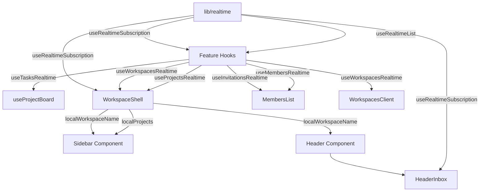

# TaskPilot — Supabase Realtime Collaboration Architecture

This document provides a detailed technical guide to the Realtime Collaboration architecture in TaskPilot. It explains the design of the reusable generic realtime sync library, specific domain hooks, state synchronization, and how they integrate seamlessly across the workspace.

---

## 1. Reusable Abstraction Layer (`src/lib/realtime/`)

To prevent code duplication and establish a clean, consistent pattern, TaskPilot features a core realtime engine that handles channel subscription and state reconciliation.

```
src/lib/realtime/
 ├── realtimeTypes.ts          # Core type definitions for events and configuration
 ├── createRealtimeChannel.ts  # Low-level helper to instantiate Supabase channels
 └── subscribeToTable.ts       # React hooks: useRealtimeSubscription & useRealtimeList
```

### 1.1 `createRealtimeChannel.ts`
Instantiates a client-side Supabase client, registers a uniquely named channel (`db-changes:<schema>:<table-name>:<filter>:<unique-id>`), binds the `postgres_changes` listener for the specified event (defaulting to `*`), and returns:
- The `channel` instance
- An `unsubscribe` function that cleanly removes the channel on component unmount.
- **Instance Isolation**: Appends a random suffix (`Math.random()`) to the channel name to prevent "cannot add postgres_changes callbacks after subscribe()" errors when multiple hooks or components subscribe to the same table simultaneously.

### 1.2 `subscribeToTable.ts`
Provides two standard React hooks:
1. **`useRealtimeSubscription`**: A low-level hook that accepts an `onPayload` callback for custom event parsing (useful for nested state structures like updating tasks nested within project boards).
2. **`useRealtimeList`**: A high-level hook that automates list sync for flat arrays:
   - **`INSERT`**: Appends the mapped item to state, guarding against duplicates (crucial when optimistic UI updates are active).
   - **`UPDATE`**: Replaces the matching item in state using a key field (e.g., `id`).
   - **`DELETE`**: Filters out the deleted item from state.

---

## 2. Domain-Specific Hooks & Where They Work

Feature-specific hooks wrap the core realtime layer to encapsulate business logic and row mapping:

### 2.1 `useTasksRealtime`
* **Path**: `src/features/project/hooks/use-tasks-realtime.ts`
* **Where It Works**: Active Kanban Board (`use-project-board.ts` hook used in `kanban-board.tsx`).
* **How It Works**: Listens for any task mutations. Since `DELETE` events do not stream `project_id` under default PostgreSQL replica identity (only primary keys are broadcasted), this hook subscribes without a filter. It performs `project_id` matching client-side for `INSERT` and `UPDATE` events, and deletes the task from the active board directly on `DELETE` events.

### 2.2 `useProjectsRealtime`
* **Path**: `src/features/project/hooks/use-projects-realtime.ts`
* **Where It Works**: Workspace layout sidebar (`workspace-shell.tsx`) and Project Dashboard.
* **How It Works**: Subscribes to projects filtered by the active `workspace_id`. Syncs additions, name updates, status changes, and deletions instantly in the left sidebar and main dashboard lists.

### 2.3 `useMembersRealtime`
* **Path**: `src/features/workspace/hooks/use-members-realtime.ts`
* **Where It Works**: Active Workspace Members tab (`members-list.tsx`).
* **How It Works**: Listens to membership updates. On `INSERT` events, it pulls the new member's profile info (name, email, avatar) client-side. On `DELETE` events, it updates the member grid and handles user redirects.

### 2.4 `useInvitationsRealtime`
* **Path**: `src/features/workspace/hooks/use-invitations-realtime.ts`
* **Where It Works**: Pending invitations grid on the Members tab (`members-list.tsx`).
* **How It Works**: Listens for new, accepted, or revoked invitations. On updates where `status !== 'pending'`, it automatically filters them out from the pending UI table.

### 2.5 `useWorkspacesRealtime`
* **Path**: `src/features/workspace/hooks/use-workspaces-realtime.ts`
* **Where It Works**: Workspace Switcher (`workspace-shell.tsx`), Header bar, and Workspaces list hub (`workspaces-client.tsx`).
* **How It Works**: Syncs workspace lists. Updates the active workspace's name instantly if edited by an owner and triggers redirects if a workspace is deleted.

---

## 3. Global Integration Map



---

## 4. Key Engineering Implementations

### 4.1 Safe Task Deletion Handling (Postgres WAL Replica Identity Gotcha)
In default PostgreSQL configurations, `DELETE` WAL logs only contain the primary key of the deleted record. In TaskPilot, deleting a task streams `old.id` to the socket client, but does not contain `old.project_id`.
* **Issue**: A client-side subscription with the filter `project_id=eq.${projectId}` will discard `DELETE` events because it cannot verify if the deleted task belongs to the filtered project.
* **Resolution**:
  * In `useTasksRealtime`, the subscription filter is set to `undefined`. `INSERT` and `UPDATE` events verify the `project_id` matching client-side. `DELETE` events trigger the removal function directly, using the local state to determine if the task exists in the active view.
  * In `workspace-shell.tsx` (sidebar task lists), the task subscriber interceptor parses the `DELETE` event separately, removing the matching task from all local sidebar projects.

### 4.2 Instant Member Eviction Flow
* **Where It Works**: Global shell level (`workspace-shell.tsx`), ensuring it runs on **all** pages under a workspace.
* **How It Works**:
  1. On mount, `workspace-shell.tsx` fetches the current user's membership record ID (`currentUserMemberId`) for the active workspace.
  2. A global subscription is established on the `workspace_members` table.
  3. When an owner revokes membership, a `DELETE` event is broadcasted.
  4. The shell compares the deleted member record ID with the current user's `currentUserMemberId`. If they match, the evicted user is redirected to `/workspaces` in under 200ms, immediately locking them out from further access.

### 4.3 Deprecation of SSE (Server-Sent Events)
To unify communication protocols and optimize client performance:
* The legacy Server-Sent Events router (`/api/sse/route.ts`) was deprecated and replaced by a static `410 Gone` response.
* The header notification badge (`header-inbox.tsx`) was completely migrated to the low-latency `useRealtimeSubscription` hook on `workspace_invitations` table with filter `email=eq.${email}`.
