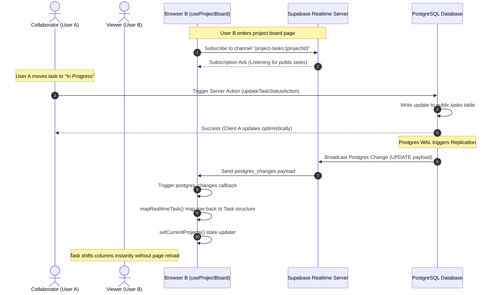

# TaskPilot — Supabase Realtime Collaboration Implementation

This document provides a detailed technical guide to the Realtime Collaboration feature in TaskPilot. It explains the architectural design, client subscription model, state synchronization, and how realtime events work side-by-side with React 19 optimistic updates.

---

## 1. Architectural Overview

TaskPilot uses **Supabase Realtime** to enable instant, cross-user collaboration on the Kanban board. When any user updates, creates, or deletes a task, the change is broadcasted via PostgreSQL Write-Ahead Logs (WAL) to all subscribed clients viewing the same project board.

### Workflow & Lifecycle Diagram

---

## 2. Interactive Flow & Subscriptions

### Establishing the Connection
In `src/features/project/hooks/use-project-board.ts`, the subscription is initialized inside a `useEffect` hook keyed on the `activeProjectId` and `members` array.

1. **Client Instantiation**: Uses `createClient()` from `@/lib/supabase/client` to get a client-side client.
2. **Channel Creation**: Subscribes to a channel named `project-tasks:${activeProjectId}`.
3. **Filter Restriction**: Uses a Postgres changes filter `project_id=eq.${activeProjectId}` to receive events only for the active project, preventing overhead from changes in other projects.
4. **Subscription Cleanup**: When the user switches projects or unmounts the board, `supabase.removeChannel(channel)` is invoked to cleanly tear down the websocket connection.

---

## 3. Realtime Callback & State Reconciliation

When database mutations happen, Supabase returns raw database row structures (snake_case column names). The hook translates these rows into frontend-compatible structures and merges them into state.

### Row Mapping (`mapRealtimeTask`)
The helper function `mapRealtimeTask` maps snake_case properties to camelCase properties:
- `assigned_to` or `assignee_id` $\rightarrow$ `assigneeId`
- Maps the profile details (`email`, `fullName`, `avatarUrl`) by matching the `assigneeId` with the `WorkspaceMember[]` array passed to the hook.

### Event Handling Logic

*   **`INSERT`**:
    *   Appends the new task to the local tasks array.
    *   **Duplicate Guard**: Checks if the task already exists (`p.tasks.some(t => t.id === newTask.id)`) before adding. This is crucial since the user who created the task already added it optimistically, avoiding duplication.
*   **`UPDATE`**:
    *   Finds the task in the list matching `updatedTask.id`.
    *   Replaces it with the new mapped task object, ensuring position, status, assignee, and description updates are applied.
*   **`DELETE`**:
    *   Removes the task by filtering it out from the project's task list (`p.tasks.filter(t => t.id !== deletedTaskId)`).

---

## 4. Synergy with React 19 Optimistic Updates

TaskPilot combines server actions, React 19 `useOptimistic` hook, and Supabase Realtime into a unified synchronization loop:

1. **Local Action**: User performs an action (e.g., drags a task).
2. **Optimistic Render**: The client-side hook immediately runs `setOptimisticProjects(...)` to reflect the layout change instantly (0ms latency).
3. **Server Action & Database Mutation**: The background Next.js Server Action executes the database change.
4. **Realtime Broadcast**: Once the DB write succeeds, the server notifies all subscribers.
5. **State Re-Sync**:
    - The initiating user receives the server action response and performs `router.refresh()`, syncing Server Components.
    - Other collaborating users receive the event through the Realtime websocket, and their local state `currentProjects` updates, instantly updating their boards.

---

## 5. File Changes Walkthrough

### 1. `src/features/project/hooks/use-project-board.ts`
*   **Imported**: `useEffect`, `useState`, and client-side `createClient`.
*   **Added `mapRealtimeTask`**: Decodes database payloads and connects them with workspace member profiles for rich UI rendering (assignee avatars/names).
*   **Added `useEffect` block**: Contains full Supabase Channel subscription logic, event dispatcher handlers (`INSERT`, `UPDATE`, `DELETE`), state updater callbacks, and tear-down logic.
*   **Created `currentProjects` state**: Intercepts parent-passed props so realtime updates can be merged locally before being fed into the `useOptimistic` hook.

### 2. `src/features/project/components/projects-list.tsx`
*   Modified to consume the updated return values from `useProjectBoard`.
*   No direct subscription code was added here, keeping the visual presentation layer separate from communication hooks.
