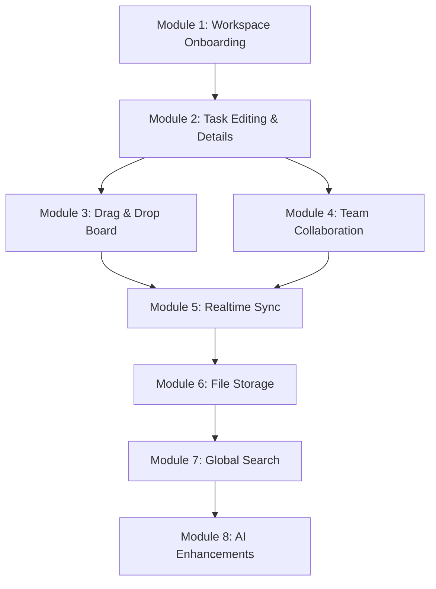

# TaskPilot — Implementation & Completion Plan

This document outlines a modular, step-by-step technical plan to complete the TaskPilot workspace application. It covers immediate bug fixes (such as the circular workspace onboarding redirect loop), core feature expansion, team collaboration, and advanced cloud integrations.

---

## 📊 Project Status & Gap Audit

The following table summarizes the current state of TaskPilot modules:

| Module / Feature | Current State | Missing Requirements / Gaps | Priority |
| :--- | :--- | :--- | :--- |
| **Authentication** | Completed | Social Auth configuration (GitHub credentials config) | Low |
| **Workspace Onboarding** | Broken / Partial | Redirects to `/workspace` when no workspace exists, causing a circular loop. No workspace creation action/form exists. | **Critical** |
| **Projects CRUD** | Partial | Create and Delete actions work. Edit project (name, description, status) is missing. | Medium |
| **Task CRUD** | Partial | Create and Delete actions work. Edit task details (assignee, priority, due date, description) is missing. | **High** |
| **Kanban Board** | Partial | Status changes are driven by button clicks (Arrow buttons) rather than visual drag-and-drop. | Medium |
| **Team Collaboration** | Pending | Workspace member invitation system, task assignment frontend controls, and role management. | **High** |
| **Realtime Sync** | Pending | Board changes are server-rendered on page refresh/action revalidation. Needs instant realtime updates. | Medium |
| **File Attachments** | Pending | Supabase Storage bucket uploads and listing attachments on task cards. | Low |
| **Search & Filtering** | Pending | Dashboard-wide query searches and sidebar filters (e.g. filter by assignee or priority). | Low |

---

## 🛠️ Step-by-Step Implementation Roadmap



### Module 1: Workspace Onboarding & Onboarding Guard
**Goal:** Fix the infinite redirect loop on `/workspace` when a user has no workspace, and allow workspace creation.

*   [ ] **Step 1.1: Create Workspace Setup Page**
    *   Create a route: `src/app/(protected)/workspace/new/page.tsx`
    *   Implement a clean, simple onboarding form requesting "Workspace Name" (e.g., "Acme Team", "My Project Space").
*   [ ] **Step 1.2: Add Workspace Server Action**
    *   Define `createWorkspaceAction` in `src/actions/workspace/workspace.actions.ts`.
    *   Connect to `WorkspaceService.createWorkspace`.
*   [ ] **Step 1.3: Update Guards & Redirects**
    *   Modify `/workspace` redirects. In `src/app/(protected)/workspace/page.tsx` and all page hooks, change:
        ```typescript
        if (!workspace) redirect("/workspace/new")
        ```
    *   In the `/workspace/new` page, check if a workspace *already* exists. If so, redirect back to `/workspace` to prevent duplicate workspace creations.

---

### Module 2: Task Details & Editing Modals
**Goal:** Expand task management beyond basic creation/deletion to support priority, due dates, assignees, and detailed descriptions.

*   [ ] **Step 2.1: Add Task Updates to Service and Actions**
    *   Add `updateTask` to `src/services/task.service.ts` allowing updates to `title`, `description`, `status`, `priority`, `due_date`, and `assignee_id`.
    *   Define `updateTaskAction` in `src/actions/workspace/workspace.actions.ts`.
*   [ ] **Step 2.2: Build Task Details Slide-Over / Modal**
    *   Create `src/components/workspace/modals/TaskDetailsModal.tsx`.
    *   Provide inputs for editing:
        *   **Title & Description** (Rich-text or simple textarea).
        *   **Status** (Dropdown: To Do, In Progress, Done).
        *   **Priority** (Dropdown/Pills: Low, Medium, High).
        *   **Due Date** (Date picker).
        *   **Assignee** (Select dropdown displaying workspace members).
*   [ ] **Step 2.3: Integrate Details Modal into KanbanBoard**
    *   Make task cards clickable to open the task details modal.

---

### Module 3: Drag-and-Drop Board
**Goal:** Convert status changes from action buttons to a smooth drag-and-drop experience.

*   [ ] **Step 3.1: Setup Native HTML5 Drag and Drop**
    *   Set up native HTML5 drag events or install a lightweight utility library.
*   [ ] **Step 3.2: Implement Draggable Cards & Droppable Columns**
    *   Update `KanbanBoard.tsx` task items to have `draggable="true"` and handle `onDragStart`.
    *   Update columns (To Do, In Progress, Done) to handle `onDragOver` and `onDrop`.
*   [ ] **Step 3.3: Link Drops to Server Actions**
    *   On a successful drop, trigger `updateTaskStatusAction` in a transition to update the database and revalidate the layout.

---

### Module 4: Team Collaboration & Invitations
**Goal:** Open workspaces to multiple team members, manage assignments, and support roles.

*   [ ] **Step 4.1: Database Tables Adjustments**
    *   Verify table permissions: Ensure `workspace_members` and invite systems can write correctly with RLS policies.
*   [ ] **Step 4.2: Build Workspace Invitations**
    *   Create an invite utility in `src/services/member.service.ts` (e.g. adding by email address or using invite codes).
    *   Build the user interface on the `/members` page (`src/app/(protected)/members/page.tsx`) to show existing members and an "Invite Member" input field.
*   [ ] **Step 4.3: Wire Task Assignment Dropdown**
    *   Fetch workspace members in the projects/tasks views.
    *   Pass the member list to the Task Create and Task Edit modals.

---

### Module 5: Realtime Workspace Sync
**Goal:** Enable active boards to instantly sync updates across multiple users on the same workspace.

*   [ ] **Step 5.1: Initialize Supabase Realtime Channels**
    *   Create a custom hook `useWorkspaceRealtime` that subscribes to changes in `tasks` and `projects` tables filtered by the active workspace/project ID.
*   [ ] **Step 5.2: Sync Local Component State**
    *   Upon receiving an `INSERT`, `UPDATE`, or `DELETE` event from the Supabase realtime hook, call `router.refresh()` to fetch fresh layout server data, or update state locally.

---


### Module 6: Global Search & Custom Filters
**Goal:** Help users find projects, tasks, or comments quickly across large workspaces.

*   [ ] **Step 7.1: Build Command Menu (Command-K)**
    *   Implement a global search dialog using custom inputs or `cmdk`.
    *   Provide navigation links directly to dynamic project pages (`/projects/[id]`) or open tasks.
*   [ ] **Step 7.2: Sidebar Filter Options**
    *   Add filter toggles on the projects list or Kanban page (e.g., "Show Only My Tasks", "High Priority Only").

---

### Module 7: AI-Powered Productivity Enhancements
**Goal:** Automate description writing, break tasks into subtasks, and estimate deadlines.

*   [ ] **Step 8.1: Integrate AI API Client**
    *   Configure route handlers/server actions connecting to OpenAI or Gemini API models.
*   [ ] **Step 8.2: "Generate Subtasks" Button**
    *   Add an AI button in the task details panel. It reads the title and description, and creates suggested checklist tasks automatically.
