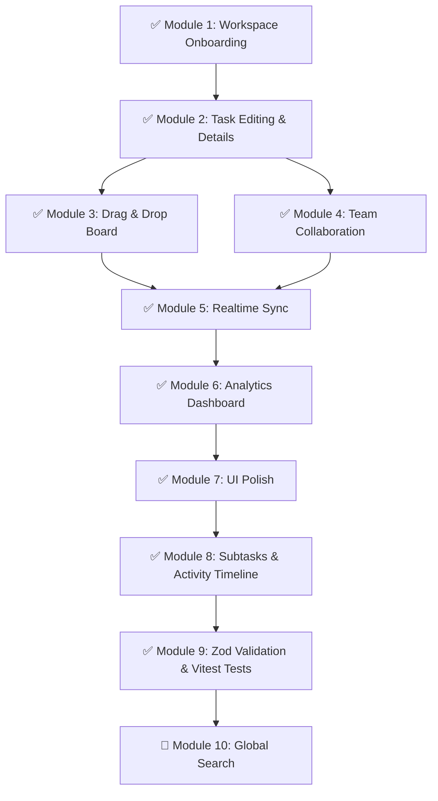

# TaskPilot — Implementation & Completion Plan

> **Last Updated:** June 18, 2026 — All core modules complete. Status updated to reflect current codebase.

This document outlines the modular, step-by-step technical plan to complete the TaskPilot workspace application. It tracks all completed modules and highlights remaining work.

---

## 📊 Project Status & Gap Audit

The following table summarizes the current state of all TaskPilot modules:

| Module / Feature | Current State | Notes | Priority |
| :--- | :--- | :--- | :--- |
| **Authentication** | ✅ Completed | Email/password + GitHub OAuth. Idempotent onboarding flow (profile, workspace, membership all guaranteed on first login). | — |
| **Workspace Onboarding** | ✅ Completed | Clean guard: `/workspaces` hub if no workspace. Duplicate workspace prevention. Owner restrictions enforced. | — |
| **Projects CRUD** | ✅ Completed | Create, read, update (name/description), delete. Edit modal implemented. | — |
| **Task CRUD** | ✅ Completed | Create, read, update (title, description, priority, due date, assignee), delete. Full task details modal. | — |
| **Kanban Board** | ✅ Completed | Smooth drag-and-drop (`@dnd-kit`), fractional indexing, custom columns (max 5), pointer-first collision detection. | — |
| **Custom Columns** | ✅ Completed | Add, rename, reorder, delete columns. Atomic RPC for deletion (move or delete tasks). Column limit enforced on client and server. | — |
| **Team Collaboration** | ✅ Completed | Email invitations (SendGrid), role management, workspace member management, project-level membership. | — |
| **Task Assignment** | ✅ Completed | Assignee selector on task cards and task details modal. Workspace member list passed into board. | — |
| **Realtime Sync** | ✅ Completed | Full Supabase Realtime integration. Tasks, columns, projects, members, invitations, workspaces all sync instantly. SSE deprecated. | — |
| **Notifications** | ✅ Completed | In-app notification system. Header inbox with real-time badge. Dismiss and mark-all-read actions. | — |
| **Workspace Analytics** | ✅ Completed | Overview page with task distribution chart, project progress, member stats, notification feed. | — |
| **UI / Design System** | ✅ Completed | Monochrome dark mode, skeleton loaders, custom scrollbars, 404 page, progress bar, pagination. | — |
| **Workspace Settings** | ✅ Completed | Rename workspace, delete workspace (owner-only), leave workspace (members). | — |
| **Workspace Switcher Hub** | ✅ Completed | `/workspaces` page showing owned + member workspaces, cookie-based switching. | — |
| **Pagination** | ✅ Completed | Client-side pagination on the project dashboard grid (6 projects per page). Pagination UI made compact. | — |
| **Task Subtasks** | ✅ Completed | Jira-inspired inline subtask table in task details modal. Optimistic UI, real-time sync, progress bar, portal-rendered dropdowns. | — |
| **Task Comments** | ✅ Completed | View, add, delete comments on tasks. Real-time updates via Supabase subscription. | — |
| **Activity Timeline** | ✅ Completed | Full task change history feed (status, priority, assignee, column, comments, subtasks). Auto-loads on modal open. | — |
| **Zod Input Validation** | ✅ Completed | Centralized `src/lib/validations/` schemas for all 5 action boundaries. `safeParse()` guards on every server action. | — |
| **Vitest Testing** | ✅ Completed | Testing framework bootstrapped. 5 schema test files covering valid + invalid inputs for all Zod validators. | — |
| **Search & Filtering** | 🔲 Pending | Global Command-K search, sidebar filters by assignee/priority/status. | Low |

---

## 🛠️ Step-by-Step Implementation Roadmap

---

### ✅ Module 1: Workspace Onboarding & Guard — COMPLETE
**Goal:** Fix the infinite redirect loop on `/workspace` and allow workspace creation.

*   [x] **Step 1.1:** Create workspace setup page (`/workspace/new` → now redirects to `/workspaces`).
*   [x] **Step 1.2:** `createWorkspaceAction` — validates owner-one-workspace constraint.
*   [x] **Step 1.3:** Updated guards in middleware proxy; idempotent onboarding post-OAuth callback ensures profile + workspace + membership are all created atomically.

---

### ✅ Module 2: Task Details & Editing Modals — COMPLETE
**Goal:** Expand task management beyond basic creation/deletion.

*   [x] **Step 2.1:** `updateTask` in `task.service.ts` — updates title, description, status, priority, due_date, assigned_to, column_id.
*   [x] **Step 2.2:** Built `TaskDetailsModal` at `src/features/tasks/components/modals/task-details-modal.tsx`. Full form with all fields.
*   [x] **Step 2.3:** Task cards on the Kanban board open the task details modal on click.

---

### ✅ Module 3: Drag-and-Drop Board — COMPLETE
**Goal:** Smooth drag-and-drop task and column reordering.

*   [x] **Step 3.1:** Installed `@dnd-kit/core` and `@dnd-kit/sortable`.
*   [x] **Step 3.2:** `KanbanBoard.tsx` with `DndContext`, `SortableContext`, `useDroppable` per column.
*   [x] **Step 3.3:** `batchUpdateTaskPositionsAction` — fractional indexing writes to Supabase on drop.
*   [x] **Step 3.4:** Custom collision detection strategy (pointer-first hybrid, empty-column support).
*   [x] **Step 3.5:** Column drag-and-drop (reorder columns horizontally). `moveColumnAction` persists positions.

---

### ✅ Module 4: Team Collaboration & Invitations — COMPLETE
**Goal:** Multi-user workspaces with role management and task assignment.

*   [x] **Step 4.1:** Database: `workspace_members`, `project_members`, `workspace_invitations` tables with RLS.
*   [x] **Step 4.2:** Email invitation flow — `InviteService` creates token, inserts DB row, calls SendGrid.
*   [x] **Step 4.3:** Invite accept/reject pages at `/invite/[token]`. Auth redirect pipeline for unauthenticated users.
*   [x] **Step 4.4:** Task assignment dropdown — `AssigneeSelector` component in task details and task card.
*   [x] **Step 4.5:** Project member management modal — add/remove workspace members from a project.
*   [x] **Step 4.6:** Leave workspace action for members; remove member action for owners/admins.

---

### ✅ Module 5: Realtime Workspace Sync — COMPLETE
**Goal:** Instant live updates across all connected clients.

*   [x] **Step 5.1:** `src/lib/realtime/` — reusable abstraction: `createRealtimeChannel.ts`, `subscribeToTable.ts`, `realtimeTypes.ts`.
*   [x] **Step 5.2:** `use-board-realtime.ts` — unified single-channel subscription per board for tasks + columns.
*   [x] **Step 5.3:** `use-projects-realtime.ts` — sidebar + dashboard project list sync.
*   [x] **Step 5.4:** `use-members-realtime.ts` — members tab live updates + eviction.
*   [x] **Step 5.5:** `use-invitations-realtime.ts` — pending invitations grid sync.
*   [x] **Step 5.6:** `use-workspaces-realtime.ts` — workspace switcher + header sync.
*   [x] **Step 5.7:** `use-tasks-realtime.ts` — board-level task subscription.
*   [x] **Step 5.8:** SSE endpoint deprecated → replaced with `410 Gone` response.
*   [x] **Step 5.9:** Instant member eviction — `workspace-shell.tsx` redirects evicted user in <200ms.

---

### ✅ Module 6: Workspace Analytics Dashboard — COMPLETE
**Goal:** Visualize workspace health and productivity metrics.

*   [x] **Step 6.1:** Parallel server-side data fetching in `workspace/page.tsx` — projects, members, tasks, columns, notifications all batched.
*   [x] **Step 6.2:** `OverviewCharts` component with Recharts:
    *   Task distribution pie/donut chart (To Do / In Progress / Done).
    *   Project progress bar chart (total vs. completed per project).
    *   Member stats table with completion rates.
    *   Recent notifications activity feed.
*   [x] **Step 6.3:** `WorkspaceAnalytics` TypeScript interface for typed data passing.

---

### ✅ Module 7: UI Polish & Design System — COMPLETE
**Goal:** Premium dark mode design and micro-interactions.

*   [x] Custom Tailwind CSS v4 design tokens in `globals.css` (semantic dark mode palette).
*   [x] Skeleton loaders for KanbanBoard SSR fallback (dynamic import).
*   [x] Portal-rendered modals avoiding `backdrop-filter` z-index clipping.
*   [x] Custom scrollbar CSS (`-webkit-scrollbar` theming).
*   [x] Animated 404 page (`not-found.tsx`) with neon accents and grid overlay.
*   [x] Client-side pagination component on project dashboard grid.
*   [x] Top loading progress bar (Amber gradient) during server transitions.
*   [x] Column limit enforcement — "Add Column" button hidden at 5 columns.
*   [x] `WorkspaceSwitchingLoading` screen during workspace cookie switch.

---

### ✅ Module 8: Subtasks & Activity Timeline — COMPLETE
**Goal:** Deep task interaction — break tasks into subtasks and track all changes.

*   [x] **Step 8.1:** Created `task_subtasks` table with Supabase Realtime publication.
*   [x] **Step 8.2:** Built `task-subtasks.service.ts` — `getSubtasks`, `addSubtask`, `updateSubtaskDetails`, `deleteSubtask`.
*   [x] **Step 8.3:** Built `<TaskSubtasks />` component with Jira-style inline table, progress bar, portal-rendered dropdowns, optimistic UI.
*   [x] **Step 8.4:** Created `task_activities`, `task_comments`, `task_comment_mentions` tables with Postgres triggers.
*   [x] **Step 8.5:** Built `get-task-timeline.action.ts` — paginated unified feed of activities + comments.
*   [x] **Step 8.6:** Built `add-comment.action.ts`, `update-comment.action.ts`, `delete-comment.action.ts`.
*   [x] **Step 8.7:** Built timeline UI components: `task-timeline.tsx`, `timeline-item-renderer.tsx`, `comment-composer.tsx`, `mention-selector.tsx`.
*   [x] **Step 8.8:** Redesigned `TaskDetailsModal` to split-pane layout — left: task details, right: timeline feed.
*   [x] **Step 8.9:** Subtask progress badge displayed on Kanban task cards.

---

### ✅ Module 9: Zod Validation & Vitest Tests — COMPLETE
**Goal:** Secure all server action boundaries and protect critical business logic with tests.

*   [x] **Step 9.1:** Created `src/lib/validations/task.schema.ts` — title length, priority/status enums, UUID checks.
*   [x] **Step 9.2:** Created `src/lib/validations/project.schema.ts` — name, description, workspace ID.
*   [x] **Step 9.3:** Created `src/lib/validations/workspace.schema.ts` — name length limits.
*   [x] **Step 9.4:** Created `src/lib/validations/kanban.schema.ts` — column name, position values.
*   [x] **Step 9.5:** Created invitation Zod schema — email format, role enum, workspace UUID.
*   [x] **Step 9.6:** Refactored all server actions to run `safeParse()` before any DB interaction.
*   [x] **Step 9.7:** Bootstrapped Vitest testing framework (was not previously in the project).
*   [x] **Step 9.8:** Wrote `tests/task.schema.test.ts`, `tests/project.schema.test.ts`, `tests/workspace.schema.test.ts`, `tests/kanban.schema.test.ts`, `tests/invitation.schema.test.ts`.
*   [x] **Step 9.9:** Removed unused `TaskPriority` imports from `create-task.action.ts` and `update-task.action.ts`.

---

### 🔲 Module 10: Global Search & Custom Filters — FUTURE
**Goal:** Help users find projects, tasks, or members quickly.

*   [ ] **Step 10.1:** Build Command Menu (Command-K) using `cmdk`.
    *   Navigate directly to project boards.
    *   Open task details from search results.
*   [ ] **Step 10.2:** Sidebar filter toggles.
    *   "Show Only My Tasks" filter.
    *   "High Priority Only" filter.
    *   Filter by assignee.

---

