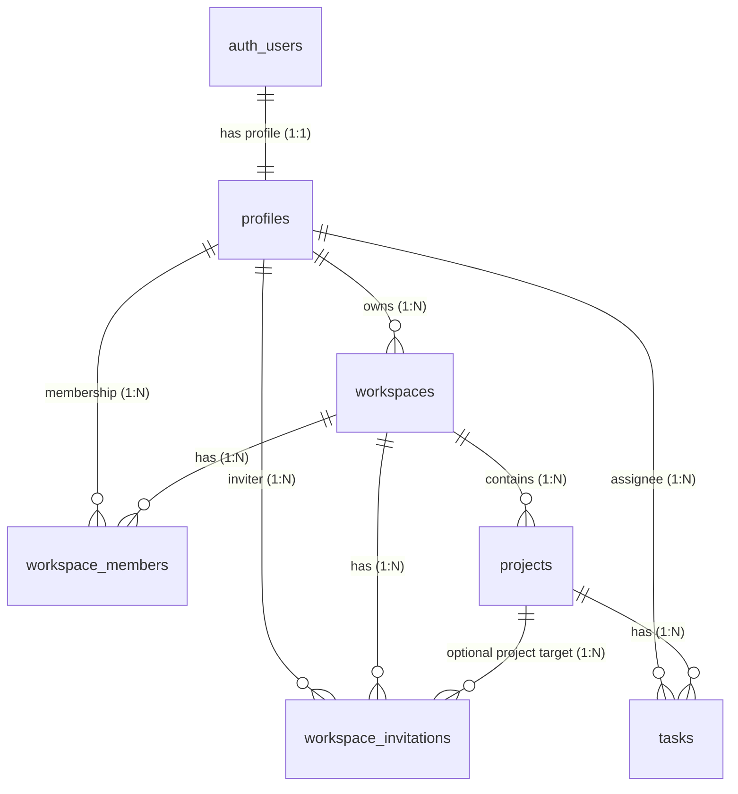

# TaskPilot Supabase Database Schema & RLS Policies

This document details the Supabase database schema, table definitions, relationships, constraints, and Row Level Security (RLS) policies implemented for **TaskPilot**.

---

## ─── Entity Relationship Diagram ───

The diagram below shows the relationships between core database entities:



---

## ─── Database Tables ───

### 1. `profiles`
Stores user profile information. It is linked directly to Supabase Auth (`auth.users`).

| Column Name  | Data Type                  | Constraints / Modifiers                     | Description                                    |
| :----------- | :------------------------- | :------------------------------------------ | :--------------------------------------------- |
| `id`         | `UUID`                     | `PRIMARY KEY`, `REFERENCES auth.users(id)`  | Matches the user ID from Supabase Auth.        |
| `email`      | `TEXT`                     | `NOT NULL`                                  | The user's primary login email.                |
| `full_name`  | `TEXT`                     | `NULLABLE`                                  | The user's display/full name.                  |
| `avatar_url` | `TEXT`                     | `NULLABLE`                                  | URL to the user's hosted avatar.               |
| `created_at` | `TIMESTAMP WITH TIME ZONE` | `NOT NULL`, `DEFAULT timezone('utc', now())`| Record creation timestamp.                     |
| `updated_at` | `TIMESTAMP WITH TIME ZONE` | `NOT NULL`, `DEFAULT timezone('utc', now())`| Record last update timestamp.                  |

#### RLS Policies:
- **SELECT**: Authenticated users can view their own profile.
  ```sql
  CREATE POLICY "Users can view own profile" ON profiles FOR SELECT
  TO authenticated USING (id = auth.uid());
  ```
- **INSERT**: Authenticated users can create their own profile.
  ```sql
  CREATE POLICY "Users can insert own profile" ON profiles FOR INSERT
  TO authenticated WITH CHECK (id = auth.uid());
  ```
- **UPDATE**: Authenticated users can modify their own profile.
  ```sql
  CREATE POLICY "Users can update own profile" ON profiles FOR UPDATE
  TO authenticated USING (id = auth.uid()) WITH CHECK (id = auth.uid());
  ```

---

### 2. `workspaces`
Represents the top-level organization tenant.

| Column Name  | Data Type                  | Constraints / Modifiers                     | Description                                    |
| :----------- | :------------------------- | :------------------------------------------ | :--------------------------------------------- |
| `id`         | `UUID`                     | `PRIMARY KEY`, `DEFAULT gen_random_uuid()`  | Unique workspace identifier.                   |
| `name`       | `TEXT`                     | `NOT NULL`                                  | Human-readable name of the workspace.          |
| `owner_id`   | `UUID`                     | `NOT NULL`, `REFERENCES profiles(id)`       | Profile that created and owns the workspace.   |
| `created_at` | `TIMESTAMP WITH TIME ZONE` | `NOT NULL`, `DEFAULT timezone('utc', now())`| Creation timestamp.                            |

#### RLS Policies:
- **SELECT**: Users can view workspaces they own or belong to.
  ```sql
  CREATE POLICY "Users can view own workspaces" ON workspaces FOR SELECT
  TO authenticated USING (
    owner_id = auth.uid() OR 
    id IN (SELECT workspace_id FROM workspace_members WHERE user_id = auth.uid())
  );
  ```
- **INSERT**: Authenticated users can create workspaces (must designate themselves as owner).
  ```sql
  CREATE POLICY "Users can create workspaces" ON workspaces FOR INSERT
  TO authenticated WITH CHECK (owner_id = auth.uid());
  ```
- **UPDATE**: Only the workspace owner can modify workspace properties.
  ```sql
  CREATE POLICY "Owners can update workspaces" ON workspaces FOR UPDATE
  TO authenticated USING (owner_id = auth.uid()) WITH CHECK (owner_id = auth.uid());
  ```
- **DELETE**: Only the workspace owner can delete the workspace.
  ```sql
  CREATE POLICY "Owners can delete workspaces" ON workspaces FOR DELETE
  TO authenticated USING (owner_id = auth.uid());
  ```

---

### 3. `workspace_members`
Maps users to workspaces and defines access roles.

| Column Name    | Data Type                  | Constraints / Modifiers                           | Description                                  |
| :------------- | :------------------------- | :------------------------------------------------ | :------------------------------------------- |
| `id`           | `UUID`                     | `PRIMARY KEY`, `DEFAULT gen_random_uuid()`        | Unique membership record identifier.         |
| `workspace_id` | `UUID`                     | `NOT NULL`, `REFERENCES workspaces(id) ON DELETE CASCADE` | Associated workspace.                        |
| `user_id`      | `UUID`                     | `NOT NULL`, `REFERENCES profiles(id) ON DELETE CASCADE`   | Associated user.                             |
| `role`         | `TEXT`                     | `NOT NULL`, `CHECK (role IN ('owner', 'admin', 'member'))` | Access level of the member.                |
| `joined_at`    | `TIMESTAMP WITH TIME ZONE` | `NOT NULL`, `DEFAULT timezone('utc', now())`      | Date/time user joined the workspace.         |

#### RLS Policies:
- **SELECT**: Members can see other members in workspaces they belong to.
  ```sql
  CREATE POLICY "Members can view workspace members" ON workspace_members FOR SELECT
  TO authenticated USING (
    workspace_id IN (SELECT workspace_id FROM workspace_members WHERE user_id = auth.uid()) OR 
    workspace_id IN (SELECT id FROM workspaces WHERE owner_id = auth.uid())
  );
  ```
- **INSERT**: Workspace owners can add members, or users can add themselves (e.g. accepting invitation).
  ```sql
  CREATE POLICY "Owners can add workspace members" ON workspace_members FOR INSERT
  TO authenticated WITH CHECK (
    user_id = auth.uid() OR 
    workspace_id IN (SELECT id FROM workspaces WHERE owner_id = auth.uid())
  );
  ```
- **DELETE**: Workspace owners can remove members, or members can delete themselves (leave workspace).
  ```sql
  CREATE POLICY "Owners can remove workspace members" ON workspace_members FOR DELETE
  TO authenticated USING (
    user_id = auth.uid() OR 
    workspace_id IN (SELECT id FROM workspaces WHERE owner_id = auth.uid())
  );
  ```

---

### 4. `projects`
Tracks projects organized within workspaces.

| Column Name    | Data Type                  | Constraints / Modifiers                           | Description                                  |
| :------------- | :------------------------- | :------------------------------------------------ | :------------------------------------------- |
| `id`           | `UUID`                     | `PRIMARY KEY`, `DEFAULT gen_random_uuid()`        | Unique project identifier.                   |
| `workspace_id` | `UUID`                     | `NOT NULL`, `REFERENCES workspaces(id) ON DELETE CASCADE` | Parent workspace.                            |
| `name`         | `TEXT`                     | `NOT NULL`                                        | Name of the project.                         |
| `description`  | `TEXT`                     | `NULLABLE`                                        | Long-form details of the project.            |
| `status`       | `TEXT`                     | `NOT NULL`, `DEFAULT 'active'`, `CHECK (status IN ('active', 'archived', 'completed'))` | Current lifecycle state. |
| `created_at`   | `TIMESTAMP WITH TIME ZONE` | `NOT NULL`, `DEFAULT timezone('utc', now())`      | Project creation timestamp.                  |

#### RLS Policies:
- **SELECT / INSERT / UPDATE / DELETE**: Allowed for any authenticated user who is a member (or owner) of the parent workspace.
  ```sql
  -- Select Policy
  CREATE POLICY "Members can view projects" ON projects FOR SELECT
  TO authenticated USING (
    workspace_id IN (SELECT workspace_id FROM workspace_members WHERE user_id = auth.uid()) OR 
    workspace_id IN (SELECT id FROM workspaces WHERE owner_id = auth.uid())
  );
  
  -- Insert Policy
  CREATE POLICY "Members can create projects" ON projects FOR INSERT
  TO authenticated WITH CHECK (
    workspace_id IN (SELECT workspace_id FROM workspace_members WHERE user_id = auth.uid()) OR 
    workspace_id IN (SELECT id FROM workspaces WHERE owner_id = auth.uid())
  );

  -- Update Policy
  CREATE POLICY "Members can update projects" ON projects FOR UPDATE
  TO authenticated USING (
    workspace_id IN (SELECT workspace_id FROM workspace_members WHERE user_id = auth.uid()) OR 
    workspace_id IN (SELECT id FROM workspaces WHERE owner_id = auth.uid())
  ) WITH CHECK (
    workspace_id IN (SELECT workspace_id FROM workspace_members WHERE user_id = auth.uid()) OR 
    workspace_id IN (SELECT id FROM workspaces WHERE owner_id = auth.uid())
  );

  -- Delete Policy
  CREATE POLICY "Members can delete projects" ON projects FOR DELETE
  TO authenticated USING (
    workspace_id IN (SELECT workspace_id FROM workspace_members WHERE user_id = auth.uid()) OR 
    workspace_id IN (SELECT id FROM workspaces WHERE owner_id = auth.uid())
  );
  ```

---

### 5. `tasks`
Individual cards/items created within a project.

| Column Name   | Data Type                  | Constraints / Modifiers                           | Description                                  |
| :------------ | :------------------------- | :------------------------------------------------ | :------------------------------------------- |
| `id`          | `UUID`                     | `PRIMARY KEY`, `DEFAULT gen_random_uuid()`        | Unique task identifier.                      |
| `project_id`  | `UUID`                     | `NOT NULL`, `REFERENCES projects(id) ON DELETE CASCADE` | Associated project.                          |
| `title`       | `TEXT`                     | `NOT NULL`                                        | Title of the task.                           |
| `description` | `TEXT`                     | `NULLABLE`                                        | Rich details/notes on the task.              |
| `status`      | `TEXT`                     | `NOT NULL`, `DEFAULT 'todo'`, `CHECK (status IN ('todo', 'in_progress', 'done'))` | Current task column location. |
| `priority`    | `TEXT`                     | `NOT NULL`, `DEFAULT 'medium'`, `CHECK (priority IN ('low', 'medium', 'high'))` | Severity/importance level.  |
| `assigned_to` | `UUID`                     | `NULLABLE`, `REFERENCES profiles(id) ON DELETE SET NULL` | Workspace member assigned to do the work. |
| `created_at`  | `TIMESTAMP WITH TIME ZONE` | `NOT NULL`, `DEFAULT timezone('utc', now())`      | Task creation timestamp.                     |

#### RLS Policies:
- **SELECT / INSERT / UPDATE / DELETE**: Allowed for any authenticated user who is a member of the project's parent workspace.
  ```sql
  -- Select Policy
  CREATE POLICY "Members can view tasks" ON tasks FOR SELECT
  TO authenticated USING (
    project_id IN (
      SELECT id FROM projects WHERE 
      workspace_id IN (SELECT workspace_id FROM workspace_members WHERE user_id = auth.uid()) OR 
      workspace_id IN (SELECT id FROM workspaces WHERE owner_id = auth.uid())
    )
  );

  -- Insert Policy
  CREATE POLICY "Members can create tasks" ON tasks FOR INSERT
  TO authenticated WITH CHECK (
    project_id IN (
      SELECT id FROM projects WHERE 
      workspace_id IN (SELECT workspace_id FROM workspace_members WHERE user_id = auth.uid()) OR 
      workspace_id IN (SELECT id FROM workspaces WHERE owner_id = auth.uid())
    )
  );

  -- Update Policy
  CREATE POLICY "Members can update tasks" ON tasks FOR UPDATE
  TO authenticated USING (
    project_id IN (
      SELECT id FROM projects WHERE 
      workspace_id IN (SELECT workspace_id FROM workspace_members WHERE user_id = auth.uid()) OR 
      workspace_id IN (SELECT id FROM workspaces WHERE owner_id = auth.uid())
    )
  ) WITH CHECK (
    project_id IN (
      SELECT id FROM projects WHERE 
      workspace_id IN (SELECT workspace_id FROM workspace_members WHERE user_id = auth.uid()) OR 
      workspace_id IN (SELECT id FROM workspaces WHERE owner_id = auth.uid())
    )
  );

  -- Delete Policy
  CREATE POLICY "Members can delete tasks" ON tasks FOR DELETE
  TO authenticated USING (
    project_id IN (
      SELECT id FROM projects WHERE 
      workspace_id IN (SELECT workspace_id FROM workspace_members WHERE user_id = auth.uid()) OR 
      workspace_id IN (SELECT id FROM workspaces WHERE owner_id = auth.uid())
    )
  );
  ```

---

### 6. `workspace_invitations`
Handles email invitations for workspace membership.

| Column Name    | Data Type                  | Constraints / Modifiers                           | Description                                  |
| :------------- | :------------------------- | :------------------------------------------------ | :------------------------------------------- |
| `id`           | `UUID`                     | `PRIMARY KEY`, `DEFAULT gen_random_uuid()`        | Unique invitation ID.                        |
| `workspace_id` | `UUID`                     | `NOT NULL`, `REFERENCES workspaces(id) ON DELETE CASCADE` | Target workspace to join.                    |
| `email`        | `TEXT`                     | `NOT NULL`                                        | Invitee email address.                       |
| `role`         | `TEXT`                     | `NOT NULL`, `CHECK (role IN ('admin', 'member'))` | Assigned role on acceptance.                 |
| `token`        | `UUID`                     | `NOT NULL`, `UNIQUE`, `DEFAULT gen_random_uuid()` | Secure random token sent in URL.             |
| `status`       | `TEXT`                     | `NOT NULL`, `DEFAULT 'pending'`, `CHECK (status IN ('pending', 'accepted', 'declined'))` | Status of the invitation. |
| `invited_by`   | `UUID`                     | `NOT NULL`, `REFERENCES profiles(id) ON DELETE CASCADE`   | Profile of the member sending the invite.    |
| `created_at`   | `TIMESTAMP WITH TIME ZONE` | `NOT NULL`, `DEFAULT timezone('utc', now())`      | Date/time invitation was generated.          |
| `expires_at`   | `TIMESTAMP WITH TIME ZONE` | `NOT NULL`                                        | Expiration limit (usually `created_at` + 7 days). |
| `project_id`   | `UUID`                     | `NULLABLE`, `REFERENCES projects(id) ON DELETE SET NULL`  | Optional initial project assignment.        |

#### RLS Policies:
- **SELECT**: Anyone (public) can view an invitation if they possess the valid unique token.
  ```sql
  CREATE POLICY "Anyone can view invitation by token" ON workspace_invitations FOR SELECT
  TO public USING (true);
  ```
- **INSERT**: Workspace owners and admins can create invitations.
  ```sql
  CREATE POLICY "Owners and admins can create invitations" ON workspace_invitations FOR INSERT
  TO authenticated WITH CHECK (
    workspace_id IN (
      SELECT id FROM workspaces WHERE owner_id = auth.uid()
      UNION
      SELECT workspace_id FROM workspace_members WHERE user_id = auth.uid() AND role IN ('owner', 'admin')
    )
  );
  ```
- **UPDATE**: Public clients can update the invitation status (e.g. accepting/declining).
  ```sql
  CREATE POLICY "Anyone can update invitation status" ON workspace_invitations FOR UPDATE
  TO public USING (true) WITH CHECK (true);
  ```
- **DELETE**: Only workspace owners and admins can delete/revoke active invitations.
  ```sql
  CREATE POLICY "Owners and admins can delete/revoke invitations" ON workspace_invitations FOR DELETE
  TO authenticated USING (
    workspace_id IN (
      SELECT id FROM workspaces WHERE owner_id = auth.uid()
      UNION
      SELECT workspace_id FROM workspace_members WHERE user_id = auth.uid() AND role IN ('owner', 'admin')
    )
  );
  ```

### 7. `notifications`
Stores workspace notifications for users.

| Column Name    | Data Type                  | Constraints / Modifiers                           | Description                                  |
| :------------- | :------------------------- | :------------------------------------------------ | :------------------------------------------- |
| `id`           | `UUID`                     | `PRIMARY KEY`, `DEFAULT gen_random_uuid()`        | Unique notification identifier.              |
| `user_id`      | `UUID`                     | `NOT NULL`, `REFERENCES profiles(id) ON DELETE CASCADE`   | The recipient user of the notification.      |
| `workspace_id` | `UUID`                     | `NULLABLE`, `REFERENCES workspaces(id) ON DELETE CASCADE` | Associated workspace.                        |
| `title`        | `TEXT`                     | `NOT NULL`                                        | Title of the notification.                   |
| `message`      | `TEXT`                     | `NOT NULL`                                        | Message body of the notification.            |
| `type`         | `TEXT`                     | `NOT NULL`                                        | Notification type (`invitation_accepted`, `invitation_rejected`, `member_left`). |
| `read`         | `BOOLEAN`                  | `NOT NULL`, `DEFAULT false`                        | Read status flag.                            |
| `created_at`   | `TIMESTAMP WITH TIME ZONE` | `NOT NULL`, `DEFAULT timezone('utc', now())`      | Record creation timestamp.                   |
| `actor_id`     | `UUID`                     | `NULLABLE`, `REFERENCES profiles(id) ON DELETE SET NULL`  | The user who triggered the notification.     |

#### RLS Policies:
- Row Level Security is disabled for notifications per user preference (public access).

---

## ─── Supabase Realtime Publications ───

To support live updates on the Kanban board, PostgreSQL Write-Ahead Logging (WAL) replica events are enabled on specific tables via the `supabase_realtime` publication.

### Enable Realtime for Tables:
```sql
-- Add the tasks table to the Supabase Realtime publication
alter publication supabase_realtime add table tasks;
```

This configuration enables clients to establish WebSocket channels subscribing to PostgreSQL `INSERT`, `UPDATE`, and `DELETE` event broadcasts on `tasks` table rows filtered by specific `project_id` matching criteria. See [Realtime-Implementation.md](file:///home/hp/Desktop/practise/TaskPilot/taskpilot/plan/Realtime-Implementation.md) for frontend handler details.
